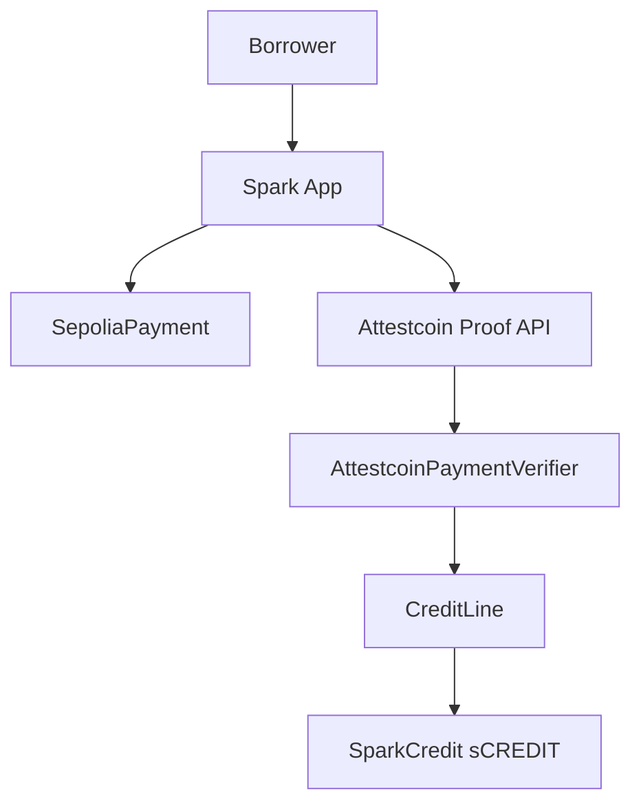

<p align="center">
  
</p>

<h1 align="center">Spark</h1>

<p align="center"><strong>Pay once. Unlock credit.</strong></p>

<p align="center">
  Verified Sepolia payment history is your credit score — no oracle.
</p>

<p align="center">
  
  
  
  
  
  
  
</p>

<p align="center">
  <a href="https://spark.sithunyein.com"><strong>spark.sithunyein.com</strong></a>
  ·
  <a href="https://spark.sithunyein.com/help">Help</a>
  ·
  <a href="https://github.com/thesithunyein/spark">GitHub</a>
  ·
  <a href="LICENSE">MIT License</a>
</p>

## Judge path in 90 seconds

Everything here is reproducible from a clean clone. No wallet, no CTC, no faucet.

**1. Contract suite: 518 tests, 0 failures**

**417 of these are the submitted suite.** The other 101 cover `AttestedStanding.sol`,
`StandingGatedCheckout.sol` and `GroupCredit.sol`, written after the deadline and marked `*`
below. The submission is frozen; these are additions to the repository, not revisions to what
was judged.

```bash
npm run test:contracts          # or: cd contracts && forge test
```

**2. The real BlockProver precompile rejecting forged proofs (read-only, zero cost)**

```bash
cd contracts && bash run-negative-paths.sh
```

Eight forged proofs (forged merkle root, wrong chain key, zero height, empty encoded transaction, mismatched sibling lengths, large chain key, max uint64 height, random bytes) are rejected by the live 0x0FD2 precompile on CC3 via `eth_call`.

**3. Click the product**

[spark.sithunyein.com](https://spark.sithunyein.com): pay a testnet deposit, watch the dual proof run, withdraw sCREDIT, repay, close.

[spark.sithunyein.com/balance](https://spark.sithunyein.com/balance) is the other generation: no deposit at all. It proves only the Sepolia balance, sizes the line at 20% of it, and carries its own draw, redeem and repay actions. Three wallets that are not mine have now run the entire loop through it — connect, attest, open, draw, repay, close — each with its own transaction trail:

| Wallet | Balance attest (Sepolia) | Open, kind-3 (Creditcoin) | Draw | Repay, kind-2 (Sepolia) · close (Creditcoin) |
|---|---|---|---|---|

| `0x75507D…CAE7` | [0x0a360e92…](https://eth-sepolia.blockscout.com/tx/0x0a360e92412bd42ba97350101c46ca44bf9ad7b71ffa45c2cf3f773fb8cf5d34) | [0x404393fc…](https://creditcoin-testnet.blockscout.com/tx/0x404393fc98e2b1d41a72b8a562feff3e6a82cdea5f68a7bf1fc91bb41c64d3b5) | [0xf160ffd2…](https://creditcoin-testnet.blockscout.com/tx/0xf160ffd264afd6ebf6d0d31ecf2558701d6751a77a446925a818215629bf2b74) · 0.00398 ETH | [0xf8870b20…](https://eth-sepolia.blockscout.com/tx/0xf8870b20d6303b9fc73defccb8cc8a6b0e0944db6bff75b9cf2ce2969f1fdce0) · [0xa165a57f…](https://creditcoin-testnet.blockscout.com/tx/0xa165a57f0ff7a19b064eaf0dd3e1753b36644487ecd3ccb3a0400dee725d3da6) |
| `0x4271A2…ADdb` | [0x666e5479…](https://eth-sepolia.blockscout.com/tx/0x666e5479a5996ffb29126dc0e47d62a96cccbc19c0efa676412502c8f1daf248) | [0x229d053f…](https://creditcoin-testnet.blockscout.com/tx/0x229d053f6be25fa9566e2e0bf9e42649dc1d69a3db74b2b93f320469e29931f7) | [0x543afada…](https://creditcoin-testnet.blockscout.com/tx/0x543afada0d09b8eee3a37d21f508aaaaea5b1f9c4a2c07c817b3a77bc29f3483) · 0.0038 ETH | [0xfe7e2af6…](https://eth-sepolia.blockscout.com/tx/0xfe7e2af6276bef562a71467ed27e55730529d25d2f01a0e7871b9adc302400e6) + [0x8ef8cf5e…](https://eth-sepolia.blockscout.com/tx/0x8ef8cf5e0aacff1117d14be06deb9f3ca60951a97b04e395837e6d08c6277f96) · [0x87487800…](https://creditcoin-testnet.blockscout.com/tx/0x87487800e4c7e7691cf52527334a6cf9e790234db2d1f89a28d0f9f7f17cc43d) |
| `0x97a8da…876C` | [0x7135e977…](https://eth-sepolia.blockscout.com/tx/0x7135e97740062076d236bde220a30adf4d278961e5926077f4070d2bf66e05bd) | [0x199ad666…](https://creditcoin-testnet.blockscout.com/tx/0x199ad66605b640429ea96245bb5fc51bdb77b0361fea9968d298a1e6a6e5ef01) | [0xef94edf3…](https://creditcoin-testnet.blockscout.com/tx/0xef94edf3b870a058569921ff36c4abac60ed20e4d8dfee2704b9faadc756b671) · 0.0038 ETH | [0x287379a6…](https://eth-sepolia.blockscout.com/tx/0x287379a6a2df7ac68002d15f5ff6de26386aa049ff37e63b07ca7f6988f2b45f) · [0xdfa72b48…](https://creditcoin-testnet.blockscout.com/tx/0xdfa72b487cdcc7e10aafe9fb3a17aa08f0e7d73133e2772188def7adfae81196) |

The first of those was drawn in full — 0.00398 ETH against 0.0199 ETH attested — and each of the three closed through a proven repayment rather than an admin call. Every hash above is the borrower's own wallet; none is a script run by me.

**Five completed credit loops, verifiable on Blockscout**

| | Open (dual proof) | Repay + close |
|---|---|---|
| Loop 1, Aug 13, 90% LTV | [0xe5ec5506...](https://creditcoin-testnet.blockscout.com/tx/0xe5ec5506ccdc54851e6c08674b2649d7efa1033220ef768dcc0583f1bf1da9c1) | [0x5092e516...](https://creditcoin-testnet.blockscout.com/tx/0x5092e5165c0fedaf85b53a8c20b9710d4b60a97b3ccaa3e815ec5fda42c18eb4) |
| Loop 2, Aug 14, 95% LTV | [0xbbec27e6...](https://creditcoin-testnet.blockscout.com/tx/0xbbec27e622b18d21bdedb24fabc072041aa0fe3ad7419b952a1e2b8754bba618) | [0x5fc0b4fb...](https://creditcoin-testnet.blockscout.com/tx/0x5fc0b4fb25493606c451ef46a1dfad0a2eab775f558b2b6820b3e1a2e723e122) |
| Loop 3, Sep 14, deposit-free, drawn in full | [0x404393fc...](https://creditcoin-testnet.blockscout.com/tx/0x404393fc98e2b1d41a72b8a562feff3e6a82cdea5f68a7bf1fc91bb41c64d3b5) | [0xa165a57f...](https://creditcoin-testnet.blockscout.com/tx/0xa165a57f0ff7a19b064eaf0dd3e1753b36644487ecd3ccb3a0400dee725d3da6) |
| Loop 4, Sep 14, deposit-free | [0x229d053f...](https://creditcoin-testnet.blockscout.com/tx/0x229d053f6be25fa9566e2e0bf9e42649dc1d69a3db74b2b93f320469e29931f7) | [0x87487800...](https://creditcoin-testnet.blockscout.com/tx/0x87487800e4c7e7691cf52527334a6cf9e790234db2d1f89a28d0f9f7f17cc43d) |
| Loop 5, Sep 14, deposit-free | [0x199ad666...](https://creditcoin-testnet.blockscout.com/tx/0x199ad66605b640429ea96245bb5fc51bdb77b0361fea9968d298a1e6a6e5ef01) | [0xdfa72b48...](https://creditcoin-testnet.blockscout.com/tx/0xdfa72b487cdcc7e10aafe9fb3a17aa08f0e7d73133e2772188def7adfae81196) |

On-chain `creditScore()` = **850**, which is the cap: 650 plus 40 per linked payment, and **6** payments are linked, so the score is clamped rather than exactly derived. Artifacts: [docs/evidence/README.md](docs/evidence/README.md) · Gas benchmarks: [docs/evidence/gas.md](docs/evidence/gas.md) · Deck: [deck.pdf](https://spark.sithunyein.com/deck.pdf)

**4. The whole on-chain record, with no wallet (read-only, zero cost)**

[spark.sithunyein.com/onchain](https://spark.sithunyein.com/onchain) renders all **74 events** the deployed contracts have emitted, across both chains, oldest first, each row linking to its Blockscout entry. No wallet, no sign-in, nothing to take on trust.

The page leads with its own scope rather than burying it: **those events came from 4 distinct wallets**, and the funnel it prints reads **1 · 4 · 4 · 4 · 4 · 4** — four wallets reached every stage from the balance attestation onward, with no drop-off between opening a line and closing it. Measured, not asserted: **7 credit lines opened (three with no deposit), 5 closed, 10 attested payments linked, 0.02908 ETH of credit drawn, 6 Sepolia deposits, 9 repayments, 12 balance attestations.** Rows are generated from chain reads into a typed module, so the page cannot drift from the chain:

```bash
npm run activity:regen          # or: cd app && node scripts/gen-chain-activity.mjs
```

This exists because the product's own history was invisible: `/activity` is scoped to the connected address, so a reviewer with a fresh wallet saw an empty product. It should not have worked that way.

**5. Reconstruction is measured, not asserted (read-only, zero cost)**

```bash
cd app && TARGET=40 DISCOVERY_CHUNKS=8 node scripts/position-scale.mjs
```

**Set `TARGET`. The bare command reproduces a different number.** The script defaults to
`TARGET=8`, so running it with no arguments reconstructs **8** wallets and reports `7/7`, not the
40-wallet corpus above. `DISCOVERY_CHUNKS` is what the committed run used alongside it, and the
script now prints both its parameters and a warning when the combination cannot reach the
requested sample. This is not a fast command: the committed run spent **1,613 archive RPC
calls** and several minutes, and the public endpoint throttles under repetition. The exact output
is committed at [docs/evidence/position-scale.json](docs/evidence/position-scale.json), so the
numbers can be checked against a recorded run instead of repeating the wait.

Across **40** real mainnet wallets holding 2 wei to 13,005 aWETH, a token-ledger reconstruction lands within **10 bps** of the live balance in **38 of 38** measurable cases (largest residual **4.36 bps**, median **2.17 bps** — the interpolated median of the absolute residuals, recorded as `medianResidualBps` in the evidence below), and **7/40** moved between wallets peer-to-peer, up to **1,715 aWETH** — movement no Aave event describes, so no event-only method could have been correct. Two sub-dust wallets are excluded because a percentage against a near-zero denominator is an artifact. The submitted deck reports the earlier 8-wallet sample; this is the expanded post-deadline corpus. Design and limits: [docs/PROOF_OF_NET_POSITION.md](docs/PROOF_OF_NET_POSITION.md). Same evidence rendered live, regenerated from these artifacts so the page cannot drift from the data: [spark.sithunyein.com/bonus](https://spark.sithunyein.com/bonus).

**6. Prove a real mainnet position and size credit from it, 10 transactions (one command)**

Runs against a **local** chain, which is how it was executed and recorded. It cannot be run
against CC3 with `forge script`: Creditcoin's block headers omit `mixHash`, which Foundry
validates when it forks, so the run fails before broadcasting. See the warning at the top of
[docs/DEPLOY_CC3.md](docs/DEPLOY_CC3.md) for the CC3 path, where the equivalent is `DRY_RUN=0 bash script/deploy-position-cc3.sh`.

```bash
cd contracts && PRIVATE_KEY=<funded dev key> forge script \
  script/ProveMainnetPosition.s.sol:ProveMainnetPosition \
  --rpc-url http://127.0.0.1:8545 --broadcast
```

Deploys the position stack, anchors at a provably-zero mainnet balance, ingests the real token ledger, reconciles against the real attested balance, and submits the real Chainlink answer — then reads the net worth back off-chain-verified. Executed end to end against a local chain; independent reads of the deployed contracts returned `netPosition = 433033874843288486772`, **$1,086,382** of proven net worth, and a **$217,276** credit limit sized from it at a 20% policy LTV. Transcript, including the 10 transactions in order and the mainnet re-verification of every input: [docs/evidence/position-stack-e2e.txt](docs/evidence/position-stack-e2e.txt).

Not yet broadcast to CC3. The deployer address (`0x7CEC5b3F9dA312072Aa987c7266f02A8Fca1bFF6`) already holds testnet CTC, so funding is not the blocker; the key is, and it belongs in `contracts/.env`, which is gitignored. Steps: [docs/DEPLOY_CC3.md](docs/DEPLOY_CC3.md), which drives that path as `DRY_RUN=0 bash script/deploy-position-cc3.sh` rather than `forge script`. Once broadcast, `cd app && node scripts/verify-cc3-position-stack.mjs` reads the deployment back off CC3, asserts it reproduces these mainnet values, and writes the evidence file only if every assertion holds.

**What is different here:** two BlockProver proofs on every credit open (payment + solvency), and strict receipt RLP decoding in which a decoded amount that differs from the claim **reverts**. That path is proven by crafted-receipt tests in [contracts/test/VerifierStrict.t.sol](contracts/test/VerifierStrict.t.sol); the bug it replaced is documented in [SECURITY_FINDINGS.md](SECURITY_FINDINGS.md).

## Attestcoin Protocol Integration Summary

Spark makes **15 distinct Attestcoin Protocol surfaces** load-bearing across 3 attested event kinds and 5 on-chain entry points. Ten sit on the path a user actually walks; five more are integrated at the contract or SDK layer and covered by tests. Both are counted, and the split is stated rather than blurred.

**On the critical path (10)** — remove any one and the product stops working:

| Surface | What It Does | Why Needed |
|---|---|---|
| `verifyAndEmit` (0x0FD2) | BlockProver precompile — proves tx inclusion + continuity | Without it, no Sepolia fact can be verified on Creditcoin |
| `MerkleProof` struct | Merkle inclusion proof construction | Required by precompile for block inclusion check |
| `ContinuityProof` struct | Chain continuity proof construction | Ensures source block is genuinely part of the chain |
| Receipt RLP parsing | `_parseReceiptLogs()` decodes Ethereum receipt on-chain | Extracts events from proven transaction data |
| Topic matching | Matches event signature from decoded logs | Identifies the correct payment event |
| Payer validation | Requires `topics[1]` to equal the claimed payer | Stops one address claiming credit for another's payment |
| Amount binding | Requires decoded amount == claimed amount | Prevents amount forgery — value is cryptographically bound |
| `ProofBuilder` SDK | Off-chain proof construction via @gluwa/usc-sdk | Assembles Merkle + continuity proofs |
| `waitUntilHeightAttested` | Polls until the source block is attested, in parallel for the dual proofs | Required before proof generation; parallel avoids a second 16-20 min wait |
| `getProof` | Generates the proof blob for on-chain verification | Produces the artifact every entry point consumes |

**Integrated and tested, not on the payment path (5):**

| Surface | What It Does | Why Needed |
|---|---|---|
| ChainInfo (0x0FD3) | Reads supported chains + attested heights | Discovers protocol state, explains attestation lag |
| `previewIngest` | Dry-run proof validation (staticcall) | Saves gas by checking validity before submitting |
| `executeBatch` | Atomic multi-proof verification | Batch N proofs in one tx, all-or-nothing |
| `calculateTxIndex` | Merkle path position of a transaction in its block | Exposed through the verifier for index queries |
| `getBatchProof` (SDK) | Batch proof generation via @gluwa/usc-sdk | Generates multiple proofs atomically in one SDK call |

**Plus 3 attested event kinds** (DepositPaid, RepaymentPaid, BalanceAttested) — **18 integration points in total.**

**What is distinctive here:** every credit open requires two proofs — one that the payment happened, one that the wallet holds funds at that moment. A single-proof design lets a borrower with an empty wallet open credit by making one payment; the second proof checks the balance at the moment of the decision.

Stated precisely, because the distinction is checkable on chain: the balance claim is verified by the second proof and recorded as `CreditOpened.attestedBalance` and the Sepolia `BalanceAttested` event. The linked-history events (`AttestedPaymentLinked`) observed on chain carry **kind 1 and kind 2**; the `BalanceAttested` event type is present as the solvency input.

Full surface enumeration: [docs/ATTESTCOIN_SURFACE.md](docs/ATTESTCOIN_SURFACE.md). Where the project goes next, and what is honestly not done yet: [docs/ROADMAP.md](docs/ROADMAP.md). What the economics actually look like, with every fact separated from every labelled assumption: [docs/UNIT_ECONOMICS.md](docs/UNIT_ECONOMICS.md).

## The Problem

2.5 billion people worldwide cannot access credit because they lack bank history, documentation, or infrastructure. Even in crypto, cross-chain credit requires trusting a middleman to verify what happened on another chain. That single point of failure defeats the purpose of decentralization.

Current solutions have three fundamental flaws:

1. **Oracles require trust.** A centralized price feed or attestation service can be manipulated, censored, or go offline. The borrower has no guarantee the oracle reports honestly.
2. **Bridges are single points of failure.** Bridges have been drained for billions. Moving assets cross-chain to prove creditworthiness exposes the borrower to bridge exploits.
3. **Self-reported history is worthless.** A borrower can open and repay their own loan 100 times to build a perfect score. Without a real counterparty, payment history proves nothing.

Spark solves all three by using the **Attestcoin Protocol** to cryptographically verify Sepolia payments on Creditcoin — no oracle, no bridge, no trust. And critically, Spark's **dual proofs** verify not just that a payment happened, but that the borrower **has the funds to cover the credit** (solvency check), so a single forged or hollow payment is not enough to open a line.

## What it is

**Spark** proves Sepolia payments with **Attestcoin** (USC / BlockProver), then opens or clears credit on **Creditcoin testnet**. No bank forms, no centralized price oracle.

- **Pay deposit** on Sepolia → dual Attestcoin proofs (deposit + ETH balance) → **open credit** on Creditcoin
- **Credit score** from on-chain attested payment history (650–850)
- **LTV bonus** from linked history (+2.5% at ≥1 payment, +5% at ≥3) plus balance-based LTV
- **Withdraw** sCREDIT, **redeem** against debt, **repay** on Sepolia to close

Live app: [https://spark.sithunyein.com](https://spark.sithunyein.com) · Deck: [deck.pdf](https://spark.sithunyein.com/deck.pdf)

## Demo flow (testnet)

```text
Pay deposit → Verify (Attestcoin ~8–20 min) → Withdraw → Redeem → Repay → Closed
```

Optional first: link past Sepolia payments on **Credit score** to raise score and LTV before opening a new line.

## Architecture



See [docs/architecture.md](docs/architecture.md) and [docs/attestcoin.md](docs/attestcoin.md).

## Project structure

Full repo layout (excluding `node_modules/`, `.next/`, `contracts/lib/` vendored deps):

```text
spark/
├── .env.example                      # Root env template (optional)
├── .gitignore
├── .gitmodules                       # forge-std submodule
├── package.json                      # Root scripts: dev, build, test:contracts
├── README.md
├── LICENSE
├── SECURITY.md
├── SECURITY_FINDINGS.md              # Two vulnerabilities found and fixed during the build
├── CONTRIBUTING.md
│
├── brand/                            # Logo source (copied into app/public/brand/)
│   ├── logo.png
│   ├── logo-mark.svg
│   ├── logo-on-orange.png
│   ├── logo-on-orange.svg
│   ├── logo-wordmark-dark.svg
│   └── logo-wordmark-light.svg
│
├── docs/
│   ├── addresses.md                  # Production + legacy contract addresses & Vercel env
│   ├── architecture.md               # System diagram, sequences
│   ├── attestcoin.md                 # USC / BlockProver integration
│   ├── ATTESTCOIN_SURFACE.md         # Every Attestcoin surface Spark uses, why needed
│   ├── THREAT_MODEL.md               # What attacks are prevented, what is still open
│   ├── SCORING.md                    # Credit score formula, LTV bonus, constants rationale
│   ├── PROOF_OF_NET_POSITION.md      # Net-position primitive: design + measured evidence
│   ├── UNIT_ECONOMICS.md             # Interest, LTV and loss given default: facts vs assumptions
│   ├── evidence/                     # On-chain proof artifacts
│   ├── ROADMAP.md                    # Milestones, what is built vs deployed vs planned
│   ├── DEPLOY_CC3.md                 # Deploying the position stack and generation 2 to CC3
│   ├── PARTICIPATE.md                # How to run the loop yourself, and what it costs you
│   ├── deck.md                       # Pitch deck notes
│   └── deploy-vercel.md              # Vercel deploy (root dir = app)
│
├── app/                              # Next.js 15 — Vercel root directory
│   ├── .env.example                  # Local / production env template
│   ├── .gitignore
│   ├── package.json
│   ├── pnpm-lock.yaml
│   ├── next.config.ts
│   ├── next-env.d.ts
│   ├── tsconfig.json
│   ├── postcss.config.js
│   ├── tailwind.config.js
│   │
│   ├── public/
│   │   ├── favicon.svg
│   │   ├── favicon.png
│   │   ├── deck.pdf
│   │   ├── deck.html
│   │   └── brand/
│   │       ├── logo.png
│   │       ├── logo-mark.svg
│   │       ├── logo-on-orange.png
│   │       ├── logo-on-orange.svg
│   │       ├── logo-wordmark-dark.svg
│   │       ├── logo-wordmark-light.svg
│   │       └── metamask.png
│   │
│   ├── scripts/                      # Read-only evidence scripts (no keys, no gas)
│   │   ├── spike-mainnet.mjs         # Day 1: prove a real mainnet tx into chainKey 3
│   │   ├── spike-position.mjs        # Day 1: extract fields from the proven EvmV1 payload
│   │   ├── aave-indexer.mjs          # Day 2: explorer-based event index + drift
│   │   ├── aave-drift-window.mjs     # Day 2: anchored ledger vs Aave-event reconciliation
│   │   ├── protocol-topics.mjs       # Day 4: topic parity + negative controls
│   │   ├── position-scale.mjs        # Day 5: reconciliation across many wallets
│   │   ├── gen-evidence-module.mjs   # Renders the mainnet evidence into a typed module
│   │   ├── gen-chain-activity.mjs    # Reads every deployed event into a typed module
│   │   └── verify-cc3-position-stack.mjs # Reads CC3 back and asserts it against mainnet facts
│   │
│   └── src/
│       ├── styles/
│       │   └── globals.css
│       │
│       ├── app/                      # App Router
│       │   ├── layout.tsx            # Root layout, providers
│       │   ├── page.tsx              # / → redirect overview
│       │   ├── overview/page.tsx     # Dashboard, score, position, checklist
│       │   ├── pay/page.tsx          # Sepolia deposit + Attestcoin verify + openCredit
│       │   ├── score/page.tsx        # Link history → creditScore + LTV bonus
│       │   ├── withdraw/page.tsx     # Withdraw + redeem sCREDIT
│       │   ├── transfer/page.tsx     # Send & receive sCREDIT
│       │   ├── repay/page.tsx        # Sepolia repay + verify + close
│       │   ├── activity/page.tsx     # Payment journal (sidebar: Payments)
│       │   ├── onchain/page.tsx       # Public on-chain record, no wallet required
│       │   ├── bonus/page.tsx        # Mainnet position proof (measured evidence)
│       │   ├── help/page.tsx         # User guide
│       │   ├── settings/page.tsx     # Wallet, networks, security
│       │   └── advanced/page.tsx     # Developer / contract links
│       │
│       ├── components/
│       │   ├── AppShell.tsx          # Page shell + sidebar
│       │   ├── Sidebar.tsx           # Nav: overview, pay, score, withdraw, …
│       │   ├── Logo.tsx
│       │   ├── ConnectButton.tsx
│       │   ├── ConnectModal.tsx
│       │   ├── AccountMenu.tsx
│       │   ├── MetricCard.tsx
│       │   ├── PositionSnapshot.tsx
│       │   ├── ActivityTable.tsx
│       │   ├── OnboardingChecklist.tsx
│       │   ├── ConfirmingStages.tsx  # Pay/repay stepper
│       │   ├── AttestcoinProofPanel.tsx
│       │   ├── LinkHistoryPanel.tsx  # Credit score linking UI
│       │   ├── SuccessBanner.tsx
│       │   ├── PaymentHistoryStrip.tsx
│       │   └── SimpleChart.tsx
│       │
│       ├── hooks/
│       │   ├── usePaymentActivity.ts # Journal + Sepolia log scan
│       │   └── useChainTxConfirmation.ts
│       │
│       └── lib/
│           ├── config.ts             # NEXT_PUBLIC_* addresses & RPC
│           ├── abi.ts                # Contract ABIs
│           ├── wagmi.tsx             # MetaMask connector, Creditcoin chain
│           ├── sparkInjected.js      # Custom injected connector
│           ├── sparkInjected.d.ts
│           ├── usc.ts                # Attestcoin proof builder (parallel waits)
│           ├── chains.ts             # ensureCreditcoinChain / ensureSepoliaChain
│           ├── errors.ts             # friendlyError messages
│           ├── flowState.ts          # sessionStorage pay/repay resume
│           ├── mainnetEvidence.ts    # GENERATED: measured mainnet facts
│           ├── chainActivity.ts      # GENERATED: every deployed event, with tx hashes
│           └── format.ts             # ETH formatting, proof encoding
│
└── contracts/                        # Foundry
    ├── foundry.toml
    ├── foundry.lock
    ├── remappings.txt
    ├── lib/
    │   └── forge-std/                # Git submodule
    │
    ├── src/
    │   ├── SepoliaPayment.sol        # payDeposit, payRepayment, attestBalance
    │   ├── CreditLine.sol            # openCredit (deposit-sized) + openCreditFromBalance (proven-balance-sized), score, history, redeem, repay
    │   ├── AttestcoinPaymentVerifier.sol
    │   ├── SparkCredit.sol           # sCREDIT ERC-20
    │   ├── MockPaymentVerifier.sol   # Unit tests only
    │   ├── MainnetPositionRegistry.sol  # Ledger net position, proven-zero anchor, capped interest
    │   ├── AttestedPriceFeed.sol     # BlockProver-verified Chainlink AnswerUpdated
    │   ├── MainnetTokenRegistry.sol  # Attested mainnet decimals + asset/liability
    │   ├── PositionValuer.sol        # Signed USD net worth (8dp base units)
    │   ├── PositionSizedCredit.sol   # Proven net worth -> credit limit under an explicit policy
    │   ├── AttestedStanding.sol      # Portable standing: one record any consumer reads, evidence ref carried* 
    │   ├── GroupCredit.sol           # Attested group credit with vouching, capped at aggregate proven history*
    │   ├── MainnetTopics.sol         # Mainnet topic constants + verification status
    │   └── interfaces/
    │       ├── IPaymentVerifier.sol
    │       └── ICreditLineView.sol   # Read-only CreditLine surface downstream contracts consume
    │
    ├── test/
    │   ├── Spark.t.sol               # 300 tests: score, history, dual-proof, batch, negative-path, edge cases, stress, lifecycle, events, combos
    │   ├── VerifierStrict.t.sol      # 6 tests: strict RLP decode, amount binding, wrong payer, long-form bloom, multi-log
    │   ├── MainnetPositionRegistry.t.sol # 30 tests: anchor rule, ordering, replay, residual bound, Day 2 regressions
    │   ├── AttestedValuation.t.sol   # 31 tests: prices, token metadata, net worth, topic parity
    │   ├── PositionStackIntegration.t.sol # 6 tests: full stack, exact real mainnet numbers
    │   ├── PositionSizedCredit.t.sol # 23 tests: policy, half-of-net-worth cap, refusal status codes
    │   ├── BalanceSizedCredit.t.sol  # 21 tests: balance sizing, refusals, score neutrality, path separation
    │   ├── AttestedStanding.t.sol    # 19 tests: evidence required, exact mirroring, eligibility, freshness*
    │   └── GroupCredit.t.sol         # 31 tests: admission gate, vouch bounds, aggregate-proven ceiling*
    │
    ├── script/
    │   ├── Deploy.s.sol
    │   ├── NegativePathLive.s.sol     # 8 forged proofs vs the live 0x0FD2 precompile
    │   ├── ProveMainnetPosition.s.sol # one command: deploy stack + prove a real mainnet position
    │   └── DeployGeneration2CreditLine.s.sol # one command: generation 2 CreditLine, reusing the deployed verifier
    │
    └── scripts/
        ├── deploy-all.sh
        ├── deploy-attestcoin.ps1
        ├── attestcoin-ctor-args.txt
        └── creditline-ctor-args.txt
```

\* **Written after the submission deadline.** `AttestedStanding.sol`, `StandingGatedCheckout.sol`
and `GroupCredit.sol` are items of [docs/CEIP.md](docs/CEIP.md) built as real code rather than
plan text. They are labelled in-source and here because the BUIDL CTC 2026 Fall submission
closed on 2026-09-13 23:59 ET, and work added afterwards should say so. None is reachable from
the live app, and nothing in the submission has been edited to include them.

`AttestedStanding.sol` and `StandingGatedCheckout.sol` are deployed to CC3 and exercised end to
end: a record was issued from generation-1 Attestcoin evidence, a merchant applied its own
policy to it, deferred an order, and was settled. The addresses and the full read-back are in
[docs/addresses.md](docs/addresses.md), and `/bonus` reads the pair live. `GroupCredit.sol` is
not deployed.

That is also why the suite reads **518** here and **417** in `docs/deck.md` and
`docs/DORAHACKS_UPDATE.md`: the deck and the submission text describe the frozen entry, and this
README describes the repository as it stands.

## Deployed contracts

### Production (live site — credit-score stack)

| Contract | Network | Address | Verified |
|---|---|---|---|
| SepoliaPayment | Ethereum Sepolia | [`0x63F0c69cf9F8b53E8eDD141d07fF2eEd2237ccc4`](https://eth-sepolia.blockscout.com/address/0x63F0c69cf9F8b53E8eDD141d07fF2eEd2237ccc4) | Yes (Blockscout) |
| AttestcoinPaymentVerifier | Creditcoin testnet | [`0xF13205Bdf48A3159d4A46309C639930aE8faC130`](https://creditcoin-testnet.blockscout.com/address/0xF13205Bdf48A3159d4A46309C639930aE8faC130) | Yes |
| CreditLine (history + score + LTV bonus) | Creditcoin testnet | [`0x2C3585019B957b16459C409f34973b583267C742`](https://creditcoin-testnet.blockscout.com/address/0x2C3585019B957b16459C409f34973b583267C742) | Yes (Blockscout) |
| SparkCredit (sCREDIT) | Creditcoin testnet | [`0x1BaDE07F2F3295528a2F7316119813b6846dFfaD`](https://creditcoin-testnet.blockscout.com/address/0x1BaDE07F2F3295528a2F7316119813b6846dFfaD) | Yes |
| BlockProver (USC precompile) | Creditcoin | `0x0000000000000000000000000000000000000FD2` | n/a |

### Legacy (Aug 13 dual-proof — finish open repay via Repay page)

| Contract | Network | Address |
|---|---|---|
| SepoliaPayment | Ethereum Sepolia | [`0x4B137F56A0b5A8633D079d2d6b34d6aC5CdD22E9`](https://eth-sepolia.blockscout.com/address/0x4B137F56A0b5A8633D079d2d6b34d6aC5CdD22E9) |
| AttestcoinPaymentVerifier | Creditcoin testnet | [`0x372BF96DFfa019A03E861d57CfC8a129172C8A3C`](https://creditcoin-testnet.blockscout.com/address/0x372BF96DFfa019A03E861d57CfC8a129172C8A3C) |
| CreditLine (dual-proof + interest) | Creditcoin testnet | [`0x1Ba750b08dC4C06B993DfDedE45d22cbD540D319`](https://creditcoin-testnet.blockscout.com/address/0x1Ba750b08dC4C06B993DfDedE45d22cbD540D319) |
| SparkCredit (sCREDIT) | Creditcoin testnet | [`0xFa18A5458a973a4E8a3eF327A88262683B64b02b`](https://creditcoin-testnet.blockscout.com/address/0xFa18A5458a973a4E8a3eF327A88262683B64b02b) |

Retired stacks and Vercel env values: [docs/addresses.md](docs/addresses.md).

## Proof of record

On-chain demo wallet: [`0x7A35f63F81357DaDE2cff8f5699b935786Aa9Da2`](https://creditcoin-testnet.blockscout.com/address/0x7A35f63F81357DaDE2cff8f5699b935786Aa9Da2). All txs below are on the **production** CreditLine (`0x2C358501…`) with real Attestcoin USC proofs (BlockProver `TransactionVerified` in each tx).

### Aug 14 open — 95% LTV (history bonus at cap)

`CreditOpened`: deposit **0.01 ETH**, attested balance **~0.357 ETH**, credit **0.0095 ETH**, **`factorBps = 9500`** (95% LTV — base 90% + 500 bps history bonus at ≥3 linked payments).

- Creditcoin: [`0xbbec27e622b18d21bdedb24fabc072041aa0fe3ad7419b952a1e2b8754bba618`](https://creditcoin-testnet.blockscout.com/tx/0xbbec27e622b18d21bdedb24fabc072041aa0fe3ad7419b952a1e2b8754bba618)

### Attested payment history — score exercised

**5** `AttestedPaymentLinked` events on production CreditLine (kinds **1** = deposit, **2** = repayment). On-chain `creditScore()` = **850** (650 base + 5 × 40).

| # | Kind | Creditcoin tx |
|---|---|---|
| 1 | deposit | [`0xe5ec5506…da9c1`](https://creditcoin-testnet.blockscout.com/tx/0xe5ec5506ccdc54851e6c08674b2649d7efa1033220ef768dcc0583f1bf1da9c1) |
| 2 | repayment | [`0xe7313fef…9f15`](https://creditcoin-testnet.blockscout.com/tx/0xe7313fefc01b8e2c0d86fc789f5479c3c5c94cd29abc8fc5a53bcfc6fd669f15) |
| 3 | repayment | [`0x5092e516…18eb4`](https://creditcoin-testnet.blockscout.com/tx/0x5092e5165c0fedaf85b53a8c20b9710d4b60a97b3ccaa3e815ec5fda42c18eb4) |
| 4 | deposit | [`0xbbec27e6…a618`](https://creditcoin-testnet.blockscout.com/tx/0xbbec27e622b18d21bdedb24fabc072041aa0fe3ad7419b952a1e2b8754bba618) |
| 5 | repayment | [`0x5fc0b4fb…e122`](https://creditcoin-testnet.blockscout.com/tx/0x5fc0b4fb25496306c451ef46a1dfad0a2eab775f558b2b6820b3e1a2e723e122) |

Full log index: [CreditLine events](https://creditcoin-testnet.blockscout.com/address/0x2C3585019B957b16459C409f34973b583267C742?tab=logs).

### Two full closed loops (Open → Withdraw → Redeem → Repay → Close)

Both loops use real USC proofs end-to-end. Sepolia repay txs linked at close via `CreditClosed`.

**Loop 1 — Aug 13** (`factorBps = 9000`, credit 0.009 ETH)

| Step | Creditcoin tx |
|---|---|
| Open | [`0xe5ec5506…da9c1`](https://creditcoin-testnet.blockscout.com/tx/0xe5ec5506ccdc54851e6c08674b2649d7efa1033220ef768dcc0583f1bf1da9c1) |
| Withdraw | [`0xbf411c5a…1f3d`](https://creditcoin-testnet.blockscout.com/tx/0xbf411c5aeba0dc7b4105b4fdc992ca09b22bb289aa008ee58690d6c575601f3d) |
| Redeem | [`0x48980365…cfb01`](https://creditcoin-testnet.blockscout.com/tx/0x48980365b9366b32b608f5945f16744c69cb1d31b091c0f0bc94120d8d8cfb01) |
| Repay + close | [`0x5092e516…18eb4`](https://creditcoin-testnet.blockscout.com/tx/0x5092e5165c0fedaf85b53a8c20b9710d4b60a97b3ccaa3e815ec5fda42c18eb4) |

**Loop 2 — Aug 14** (`factorBps = 9500`, credit 0.0095 ETH)

| Step | Creditcoin tx |
|---|---|
| Open | [`0xbbec27e6…a618`](https://creditcoin-testnet.blockscout.com/tx/0xbbec27e622b18d21bdedb24fabc072041aa0fe3ad7419b952a1e2b8754bba618) |
| Withdraw | [`0x3bc160b1…2789`](https://creditcoin-testnet.blockscout.com/tx/0x3bc160b1a2a1e3c0b1e5065387f15c0383fcad9f2c0566b8653a41fddf232789) |
| Redeem | [`0x9177c410…d34d`](https://creditcoin-testnet.blockscout.com/tx/0x9177c4107aae3189926653fb7e9c8c2d24b9770c75b40cb56fb72574f081d34d) |
| Repay + close | [`0x5fc0b4fb…e122`](https://creditcoin-testnet.blockscout.com/tx/0x5fc0b4fb25496306c451ef46a1dfad0a2eab775f558b2b6820b3e1a2e723e122) |

**Sepolia repayments** (kind-2 USC proofs consumed at close):

- Loop 1: [`0x5fa5d7a2…9785`](https://sepolia.etherscan.io/tx/0x5fa5d7a22da9fbefd4cf0a6190f9ee342967637f470c53fd4adf3e2431229785)
- Loop 2: [`0xf3825f7f…ebe6`](https://sepolia.etherscan.io/tx/0xf3825f7f73461d9ca54ad6c3183521a85a7dcddee8b7a12dd9f820c40aa0ebe6)

## Quickstart

```bash
# Install (from repo root)
pnpm install --dir app

# Contracts
cd contracts && forge test

# App
cd ../app
cp .env.example .env.local   # fill RPC URLs if needed
pnpm dev
```

Open [http://localhost:3000](http://localhost:3000). User guide: in-app **Help** or [spark.sithunyein.com/help](https://spark.sithunyein.com/help).

## Deploy

| Target | How |
|---|---|
| App | Vercel, root directory `app` — [docs/deploy-vercel.md](docs/deploy-vercel.md) |
| Contracts | Foundry `contracts/script/Deploy.s.sol` → update [docs/addresses.md](docs/addresses.md) + Vercel env |

## Credit score (on-chain)

| Metric | Rule |
|---|---|
| Score | 650 base + 40 × attested payments (cap **850**) |
| LTV bonus | +250 bps (≥1 payment), +500 bps (≥3 payments) |
| Balance LTV | ≥2× deposit → 90%, ≥1× → 85%, else 80% base |
| Balance-sized line (generation 2) | **No deposit.** `openCreditFromBalance`: `limit = attested balance × 20%`, floor 0.0001 ETH, and a balance attestation never moves the score because a balance is not a payment. Live on CC3 since 2026-09-14 with a line opened and drawn against it — [docs/DEPLOY_CC3.md](docs/DEPLOY_CC3.md) |
| Proof | `submitAttestedPayment` links past Sepolia txs; `openCredit` / `repayCredit` also count |

Formula lives in `contracts/src/CreditLine.sol` — readable via `creditScore()` and `getHistory()`.

## Roadmap

| Phase | Focus |
|---|---|
| **Now** | Live testnet: dual Attestcoin proofs, score, history LTV, **strict receipt log decoding with amount binding**, full borrow/repay loop |
| **Deposit-free credit, live** | Credit that does not require a deposit: sized from a proven Sepolia balance (`openCreditFromBalance`) or from a proven Ethereum mainnet net worth (`PositionSizedCredit`). Both are live on CC3 and verified. The balance-sized path runs end to end from the product rather than from a script: a first line was opened on 2026-09-14 and the full 0.00398 ETH limit was drawn from `/balance`, which carries that generation's draw, redeem and close actions, while `/repay` settles it from a proven Sepolia repayment. The demo-described deposit flow is untouched on `/pay`. The mainnet position layer is executed locally and not broadcast. [docs/ROADMAP.md](docs/ROADMAP.md) |
| **Portable standing** | A verified record that a *different* product reads and gates on, with the Attestcoin evidence reference carried into the decision. Deployed and exercised end to end — [docs/addresses.md](docs/addresses.md) |
| **Next** | Faster verify UX (parallel attestation, caching) |
| **Later** | Mainnet, audit, lending pool, single-network UX |

## Security

Not audited. Testnet only. See [SECURITY.md](SECURITY.md). No private keys on Vercel. Two vulnerabilities were found and fixed during the build: [SECURITY_FINDINGS.md](SECURITY_FINDINGS.md).

**Verifier note:** BlockProver proves inclusion cryptographically. The adapter **strictly decodes the receipt RLP** from the proven `encodedTransaction`, matching event topic, indexed payer, and non-indexed amount from decoded logs. Amount is cryptographically bound (not trusting `claim.amount`) — once the receipt parses, a decoded amount that differs from `claim.amount` **reverts**; it never falls through to the weaker substring scan. The strict path is proven by 6 dedicated tests with crafted RLP receipts (`test/VerifierStrict.t.sol`). Per the Aug 18 AMA, receipt log data is confirmed available via BlockProver.

**ChainInfo:** the 0x0FD3 precompile uses snake_case selectors (`get_supported_chains`, `get_latest_attestation_height_and_hash`) — verified live on CC3, and it reports both Sepolia (chainKey 1) and **Ethereum mainnet (chainKey 3)** as attested source chains. See docs/THREAT_MODEL.md.

## Live Precompile Tests (Zero Cost)

Spark includes 8 live negative-path tests against the real BlockProver precompile on CC3 testnet. These use `eth_call` (read-only) — zero gas, zero CTC, zero cost.

```bash
cd contracts && bash run-negative-paths.sh
```

Results:
- Forged merkle root → REJECTED
- Wrong chain key (99) → REJECTED
- Zero height → REJECTED
- Empty encoded transaction → REJECTED
- Mismatched sibling lengths → REJECTED
- Very large chain key (9999) → REJECTED
- Max uint64 height → REJECTED
- Random bytes as proof → REJECTED

**All 8 forged proofs rejected by the real BlockProver precompile.** Judges can run this themselves.

## License

MIT — [LICENSE](LICENSE).
