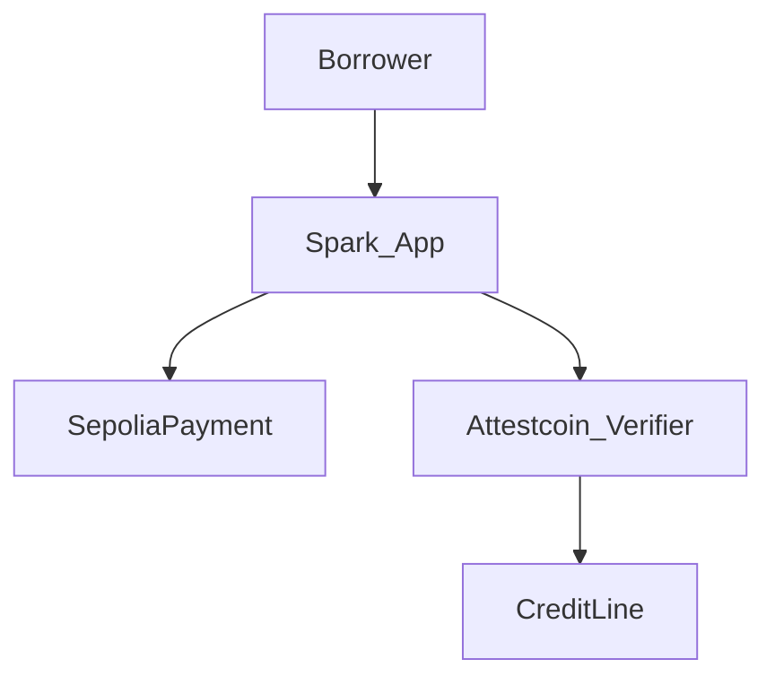

<p align="center">
  
</p>

<h1 align="center">Spark</h1>

<p align="center"><strong>Pay once. Unlock credit.</strong></p>

<p align="center">
  We verify your payment so credit can open—no paperwork chase.
</p>

<p align="center">
  
  
  
  
  
  
  
</p>

## What it is

Other credit apps can’t trust a payment that happened somewhere else without paperwork or a middleman. **Spark** verifies the payment with **Attestcoin**, then unlocks or clears credit on **Creditcoin**.

- Track: **DeFi** (BUIDL CTC 2026 Fall)
- No AI demo — rules, proofs, balances only
- Demo funds on testnets

## Architecture



User flow: **Pay deposit → Confirming → Credit ready → Repay → Closed**

See [docs/architecture.md](docs/architecture.md) and [docs/attestcoin.md](docs/attestcoin.md).

## Quickstart

```bash
# contracts
cd contracts
forge test

# app
cd ../app
cp .env.example .env.local
pnpm install
pnpm dev
```

Open [http://localhost:3000](http://localhost:3000) — you should understand Spark in **3 seconds**: *Pay once. Unlock credit.*

## Deploy

- Contracts: `forge script` (see `contracts/script/Deploy.s.sol`) → fill [docs/addresses.md](docs/addresses.md)
- App: free Vercel — [docs/deploy-vercel.md](docs/deploy-vercel.md) (Root Directory = `app`)

## Security

Not audited. See [SECURITY.md](SECURITY.md). No private keys on Vercel.

## Hackathon

DoraHacks sector: **DeFi**. Attestcoin integration summary: [docs/attestcoin.md](docs/attestcoin.md).
