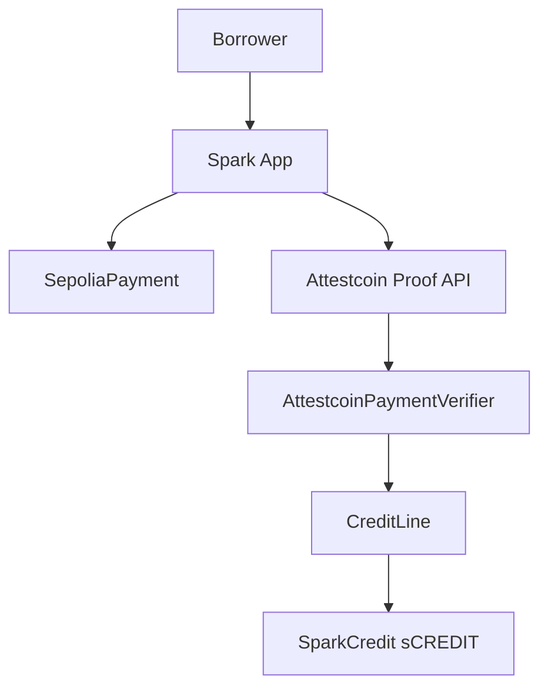

<p align="center">
  
</p>

<h1 align="center">Spark</h1>

<p align="center"><strong>Pay once. Unlock credit.</strong></p>

<p align="center">
  Verified Sepolia payment history is your credit score — no oracle.
</p>

<p align="center">
  
  
  
  
  
  
  
</p>

<p align="center">
  <a href="https://spark.sithunyein.com"><strong>spark.sithunyein.com</strong></a>
  ·
  <a href="https://spark.sithunyein.com/help">Help</a>
  ·
  <a href="https://github.com/thesithunyein/spark-ctc">GitHub</a>
  ·
  <a href="LICENSE">MIT License</a>
</p>

## What it is

**Spark** proves Sepolia payments with **Attestcoin** (USC / BlockProver), then opens or clears credit on **Creditcoin testnet**. No bank forms, no centralized price oracle.

- **Pay deposit** on Sepolia → dual Attestcoin proofs (deposit + ETH balance) → **open credit** on Creditcoin
- **Credit score** from on-chain attested payment history (650–850)
- **LTV bonus** from linked history (+2.5% at ≥1 payment, +5% at ≥3) plus balance-based LTV
- **Withdraw** sCREDIT, **redeem** against debt, **repay** on Sepolia to close

Live app: [https://spark.sithunyein.com](https://spark.sithunyein.com) · Deck: [deck.pdf](https://spark.sithunyein.com/deck.pdf)

## Demo flow (testnet)

```text
Pay deposit → Verify (Attestcoin ~8–20 min) → Withdraw → Redeem → Repay → Closed
```

Optional first: link past Sepolia payments on **Credit score** to raise score and LTV before opening a new line.

## Architecture



See [docs/architecture.md](docs/architecture.md) and [docs/attestcoin.md](docs/attestcoin.md).

## Project structure

Full repo layout (excluding `node_modules/`, `.next/`, `contracts/lib/` vendored deps):

```text
spark/
├── .env.example                      # Root env template (optional)
├── .gitignore
├── .gitmodules                       # forge-std submodule
├── package.json                      # Root scripts: dev, build, test:contracts
├── README.md
├── LICENSE
├── SECURITY.md
├── CONTRIBUTING.md
│
├── brand/                            # Logo source (copied into app/public/brand/)
│   ├── logo.png
│   ├── logo-mark.svg
│   ├── logo-on-orange.png
│   ├── logo-on-orange.svg
│   ├── logo-wordmark-dark.svg
│   └── logo-wordmark-light.svg
│
├── docs/
│   ├── addresses.md                  # Production + legacy contract addresses & Vercel env
│   ├── architecture.md               # System diagram, sequences
│   ├── attestcoin.md                 # USC / BlockProver integration
│   ├── deck.md                       # Pitch deck notes
│   └── deploy-vercel.md              # Vercel deploy (root dir = app)
│
├── app/                              # Next.js 15 — Vercel root directory
│   ├── .env.example                  # Local / production env template
│   ├── .gitignore
│   ├── package.json
│   ├── pnpm-lock.yaml
│   ├── next.config.ts
│   ├── next-env.d.ts
│   ├── tsconfig.json
│   ├── postcss.config.js
│   ├── tailwind.config.js
│   │
│   ├── public/
│   │   ├── favicon.svg
│   │   ├── favicon.png
│   │   ├── deck.pdf
│   │   ├── deck.html
│   │   └── brand/
│   │       ├── logo.png
│   │       ├── logo-mark.svg
│   │       ├── logo-on-orange.png
│   │       ├── logo-on-orange.svg
│   │       ├── logo-wordmark-dark.svg
│   │       ├── logo-wordmark-light.svg
│   │       └── metamask.png
│   │
│   └── src/
│       ├── styles/
│       │   └── globals.css
│       │
│       ├── app/                      # App Router
│       │   ├── layout.tsx            # Root layout, providers
│       │   ├── page.tsx              # / → redirect overview
│       │   ├── overview/page.tsx     # Dashboard, score, position, checklist
│       │   ├── pay/page.tsx          # Sepolia deposit + Attestcoin verify + openCredit
│       │   ├── score/page.tsx        # Link history → creditScore + LTV bonus
│       │   ├── withdraw/page.tsx     # Withdraw + redeem sCREDIT
│       │   ├── transfer/page.tsx     # Send & receive sCREDIT
│       │   ├── repay/page.tsx        # Sepolia repay + verify + close
│       │   ├── activity/page.tsx     # Payment journal (sidebar: Payments)
│       │   ├── help/page.tsx         # User guide
│       │   ├── settings/page.tsx     # Wallet, networks, security
│       │   └── advanced/page.tsx     # Developer / contract links
│       │
│       ├── components/
│       │   ├── AppShell.tsx          # Page shell + sidebar
│       │   ├── Sidebar.tsx           # Nav: overview, pay, score, withdraw, …
│       │   ├── Logo.tsx
│       │   ├── ConnectButton.tsx
│       │   ├── ConnectModal.tsx
│       │   ├── AccountMenu.tsx
│       │   ├── MetricCard.tsx
│       │   ├── PositionSnapshot.tsx
│       │   ├── ActivityTable.tsx
│       │   ├── OnboardingChecklist.tsx
│       │   ├── ConfirmingStages.tsx  # Pay/repay stepper
│       │   ├── AttestcoinProofPanel.tsx
│       │   ├── LinkHistoryPanel.tsx  # Credit score linking UI
│       │   ├── SuccessBanner.tsx
│       │   ├── PaymentHistoryStrip.tsx
│       │   └── SimpleChart.tsx
│       │
│       ├── hooks/
│       │   ├── usePaymentActivity.ts # Journal + Sepolia log scan
│       │   └── useChainTxConfirmation.ts
│       │
│       └── lib/
│           ├── config.ts             # NEXT_PUBLIC_* addresses & RPC
│           ├── abi.ts                # Contract ABIs
│           ├── wagmi.tsx             # MetaMask connector, Creditcoin chain
│           ├── sparkInjected.js      # Custom injected connector
│           ├── sparkInjected.d.ts
│           ├── usc.ts                # Attestcoin proof builder (parallel waits)
│           ├── chains.ts             # ensureCreditcoinChain / ensureSepoliaChain
│           ├── errors.ts             # friendlyError messages
│           ├── flowState.ts          # sessionStorage pay/repay resume
│           └── format.ts             # ETH formatting, proof encoding
│
└── contracts/                        # Foundry
    ├── foundry.toml
    ├── foundry.lock
    ├── remappings.txt
    ├── lib/
    │   └── forge-std/                # Git submodule
    │
    ├── src/
    │   ├── SepoliaPayment.sol        # payDeposit, payRepayment, attestBalance
    │   ├── CreditLine.sol            # openCredit, score, history bonus, redeem, repay
    │   ├── AttestcoinPaymentVerifier.sol
    │   ├── SparkCredit.sol           # sCREDIT ERC-20
    │   ├── MockPaymentVerifier.sol   # Unit tests only
    │   └── interfaces/
    │       └── IPaymentVerifier.sol
    │
    ├── test/
    │   └── Spark.t.sol               # Score, history, dual-proof open
    │
    ├── script/
    │   └── Deploy.s.sol
    │
    └── scripts/
        ├── deploy-all.sh
        ├── deploy-attestcoin.ps1
        ├── attestcoin-ctor-args.txt
        └── creditline-ctor-args.txt
```

## Deployed contracts (production — live site)

| Contract | Network | Address |
|---|---|---|
| SepoliaPayment | Sepolia | `0x63F0c69cf9F8b53E8eDD141d07fF2eEd2237ccc4` |
| AttestcoinPaymentVerifier | Creditcoin testnet | `0xF13205Bdf48A3159d4A46309C639930aE8faC130` |
| CreditLine (score + history + LTV) | Creditcoin testnet | `0x2C3585019B957b16459C409f34973b583267C742` |
| SparkCredit (sCREDIT) | Creditcoin testnet | `0x1BaDE07F2F3295528a2F7316119813b6846dFfaD` |
| BlockProver (USC) | Creditcoin | `0x0000000000000000000000000000000000000FD2` |

All production contracts verified on Blockscout where applicable. Legacy addresses for finishing old-line repay: [docs/addresses.md](docs/addresses.md).

## Quickstart

```bash
# Install (from repo root)
pnpm install --dir app

# Contracts
cd contracts && forge test

# App
cd ../app
cp .env.example .env.local   # fill RPC URLs if needed
pnpm dev
```

Open [http://localhost:3000](http://localhost:3000). User guide: in-app **Help** or [spark.sithunyein.com/help](https://spark.sithunyein.com/help).

## Deploy

| Target | How |
|---|---|
| App | Vercel, root directory `app` — [docs/deploy-vercel.md](docs/deploy-vercel.md) |
| Contracts | Foundry `contracts/script/Deploy.s.sol` → update [docs/addresses.md](docs/addresses.md) + Vercel env |

## Credit score (on-chain)

| Metric | Rule |
|---|---|
| Score | 650 base + 40 × attested payments (cap **850**) |
| LTV bonus | +250 bps (≥1 payment), +500 bps (≥3 payments) |
| Balance LTV | ≥2× deposit → 90%, ≥1× → 85%, else 80% base |
| Proof | `submitAttestedPayment` links past Sepolia txs; `openCredit` / `repayCredit` also count |

Formula lives in `contracts/src/CreditLine.sol` — readable via `creditScore()` and `getHistory()`.

## Roadmap

| Phase | Focus |
|---|---|
| **Now** | Live testnet: dual Attestcoin proofs, score, history LTV, full borrow/repay loop |
| **Next** | Faster verify UX, stricter log decoding in verifier |
| **Later** | Mainnet, audit, single-network UX |

## Security

Not audited. Testnet only. See [SECURITY.md](SECURITY.md). No private keys on Vercel.

**Verifier note:** BlockProver proves inclusion; the adapter checks contract, topic, and payer in tx bytes. Fine for demo; production would strict-decode receipts and bind amounts.

## License

MIT — [LICENSE](LICENSE).
