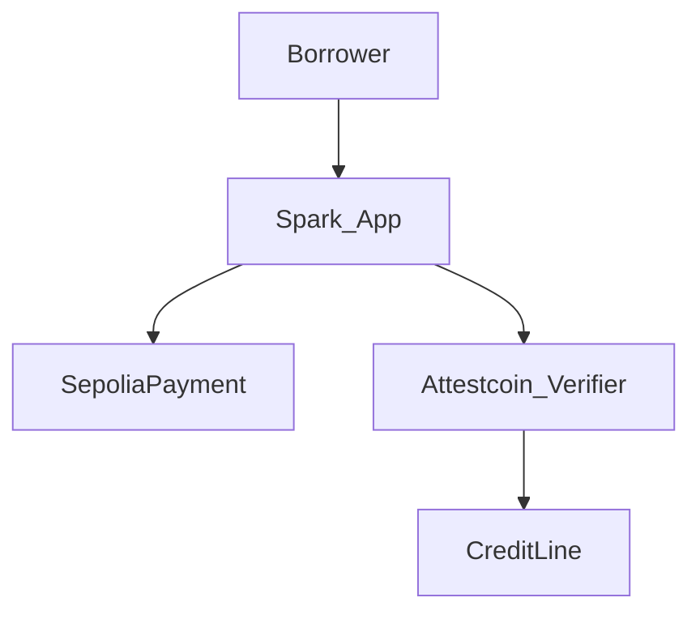

<p align="center">
  
</p>

<h1 align="center">Spark</h1>

<p align="center"><strong>Pay once. Unlock credit.</strong></p>

<p align="center">
  We verify your payment so credit can open. No paperwork chase.
</p>

<p align="center">
  
  
  
  
  
  
  
</p>

<p align="center">
  <a href="https://spark.sithunyein.com"><strong>spark.sithunyein.com</strong></a>
  ·
  <a href="https://github.com/thesithunyein/spark-ctc">GitHub</a>
  ·
  <a href="LICENSE">MIT License</a>
</p>

## What it is

Other credit apps cannot trust a payment that happened somewhere else without paperwork or a middleman. **Spark** verifies Sepolia facts with **Attestcoin**, then unlocks or clears credit on **Creditcoin**.

- DeFi credit on Creditcoin (BUIDL CTC 2026 Fall)
- **Two** Attestcoin proofs to open: deposit payment + Sepolia ETH balance (sizes LTV)
- Debt accrues interest; redeem burns sCREDIT; attested Sepolia repay closes the line
- Live app uses **Attestcoin Protocol** (USC BlockProver) — no centralized oracle

## Architecture



User flow: **Pay deposit → Attest balance → Dual Attestcoin proofs → Credit ready → Withdraw / Redeem → Repay → Closed**

See [docs/architecture.md](docs/architecture.md) and [docs/attestcoin.md](docs/attestcoin.md).

## Quickstart

```bash
# contracts
cd contracts
forge test

# app
cd ../app
cp .env.example .env.local
pnpm install
pnpm dev
```

Open [http://localhost:3000](http://localhost:3000). In-app **Help** explains the flow for new users.

Live: [https://spark.sithunyein.com](https://spark.sithunyein.com) · Deck: [spark.sithunyein.com/deck.pdf](https://spark.sithunyein.com/deck.pdf)

## Deployed contracts (testnet)

In-window Fall 2026 deploys (2026-08-13):

| Contract | Network | Address |
|---|---|---|
| SepoliaPayment | Sepolia | `0x4B137F56A0b5A8633D079d2d6b34d6aC5CdD22E9` |
| AttestcoinPaymentVerifier | Creditcoin testnet | `0x372BF96DFfa019A03E861d57CfC8a129172C8A3C` |
| CreditLine (dual-proof + interest) | Creditcoin testnet | `0x1Ba750b08dC4C06B993DfDedE45d22cbD540D319` |
| SparkCredit (sCREDIT) | Creditcoin testnet | `0xFa18A5458a973a4E8a3eF327A88262683B64b02b` |
| BlockProver | Creditcoin | `0x0000000000000000000000000000000000000FD2` |

Details / retired addresses: [docs/addresses.md](docs/addresses.md)

## Deploy

- Contracts: Foundry (`contracts/script/Deploy.s.sol`) → update [docs/addresses.md](docs/addresses.md)
- App: Vercel — [docs/deploy-vercel.md](docs/deploy-vercel.md) (Root Directory = `app`)

## Roadmap

| Phase | Focus |
|---|---|
| **Now** | Dual Attestcoin proofs (deposit + balance), interest, redeem — live on testnet |
| **Next** | Strict log/ABI decoding in the verifier, faster attestation UX |
| **Later** | Mainnet readiness, audit, lending pool / single-network UX |

## Security

Not audited. Testnet only. See [SECURITY.md](SECURITY.md). No private keys on Vercel.

**Testnet verifier note:** BlockProver proves inclusion cryptographically. The adapter then checks that the payment contract, event topic, and payer appear in the proven tx bytes (substring match) — not full log/ABI decoding. Fine for this hackathon demo; production would strict-decode receipts and bind amounts.

## License

MIT. See [LICENSE](LICENSE).
