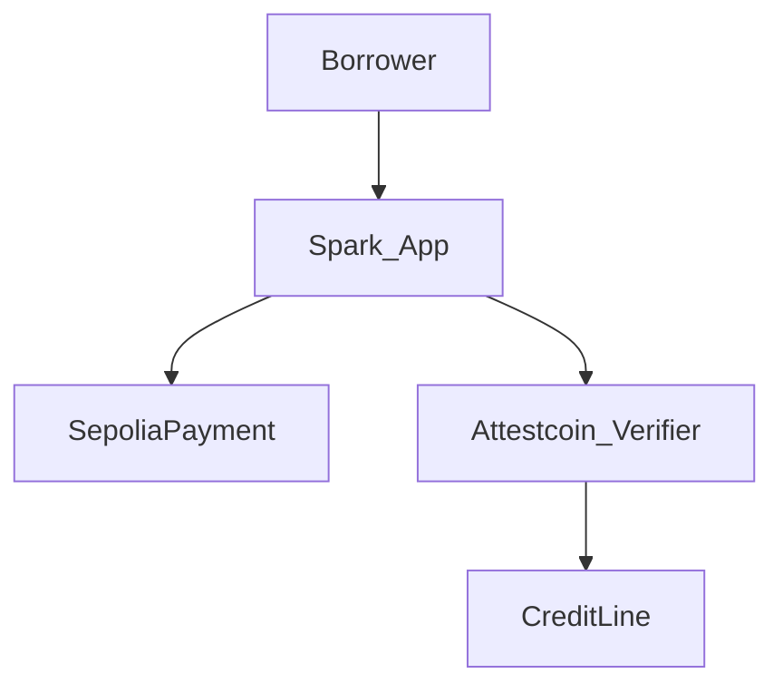

<p align="center">
  
</p>

<h1 align="center">Spark</h1>

<p align="center"><strong>Pay once. Unlock credit.</strong></p>

<p align="center">
  We verify your payment so credit can open. No paperwork chase.
</p>

<p align="center">
  
  
  
  
  
  
  
</p>

<p align="center">
  <a href="https://spark.sithunyein.com"><strong>spark.sithunyein.com</strong></a>
  ·
  <a href="https://github.com/thesithunyein/spark-ctc">GitHub</a>
  ·
  <a href="LICENSE">MIT License</a>
</p>

## What it is

Other credit apps cannot trust a payment that happened somewhere else without paperwork or a middleman. **Spark** verifies the payment, then unlocks or clears credit on **Creditcoin**.

- DeFi credit on Creditcoin (BUIDL CTC 2026 Fall)
- Rules, proofs, and on-chain balances only
- Runs on testnets today (Sepolia + Creditcoin testnet)
- Live app uses **Attestcoin Protocol** (USC BlockProver) to verify Sepolia payments before credit opens

## Architecture



User flow: **Pay deposit → Confirming → Credit ready → Repay → Closed**

See [docs/architecture.md](docs/architecture.md) and [docs/attestcoin.md](docs/attestcoin.md).

## Quickstart

```bash
# contracts
cd contracts
forge test

# app
cd ../app
cp .env.example .env.local
pnpm install
pnpm dev
```

Open [http://localhost:3000](http://localhost:3000). In-app **Help** explains the flow for new users.

Live: [https://spark.sithunyein.com](https://spark.sithunyein.com) · Deck: [spark.sithunyein.com/deck.pdf](https://spark.sithunyein.com/deck.pdf)

## Deployed contracts (testnet)

| Contract | Network | Address |
|---|---|---|
| SepoliaPayment | Sepolia | `0xfe6D6efD09D2Da22656AA197713A4dEdd064E14F` |
| AttestcoinPaymentVerifier | Creditcoin testnet | `0xB8d175f48cbeCc70448639000F749463734C08d0` |
| CreditLine | Creditcoin testnet | `0x336bF0cF045048f7a17efE6eD50671f304B4E815` |

Details: [docs/addresses.md](docs/addresses.md)

## Deploy

- Contracts: Foundry (`contracts/script/Deploy.s.sol`) → update [docs/addresses.md](docs/addresses.md)
- App: Vercel — [docs/deploy-vercel.md](docs/deploy-vercel.md) (Root Directory = `app`)

## Roadmap

| Phase | Focus |
|---|---|
| **Now** | Testnet demo with live Attestcoin USC proofs |
| **Next** | Stronger receipt decoding, faster attestation UX |
| **Later** | Mainnet readiness, audit, simpler single-network UX |

## Security

Not audited. Testnet only. See [SECURITY.md](SECURITY.md). No private keys on Vercel.

## License

MIT. See [LICENSE](LICENSE).
