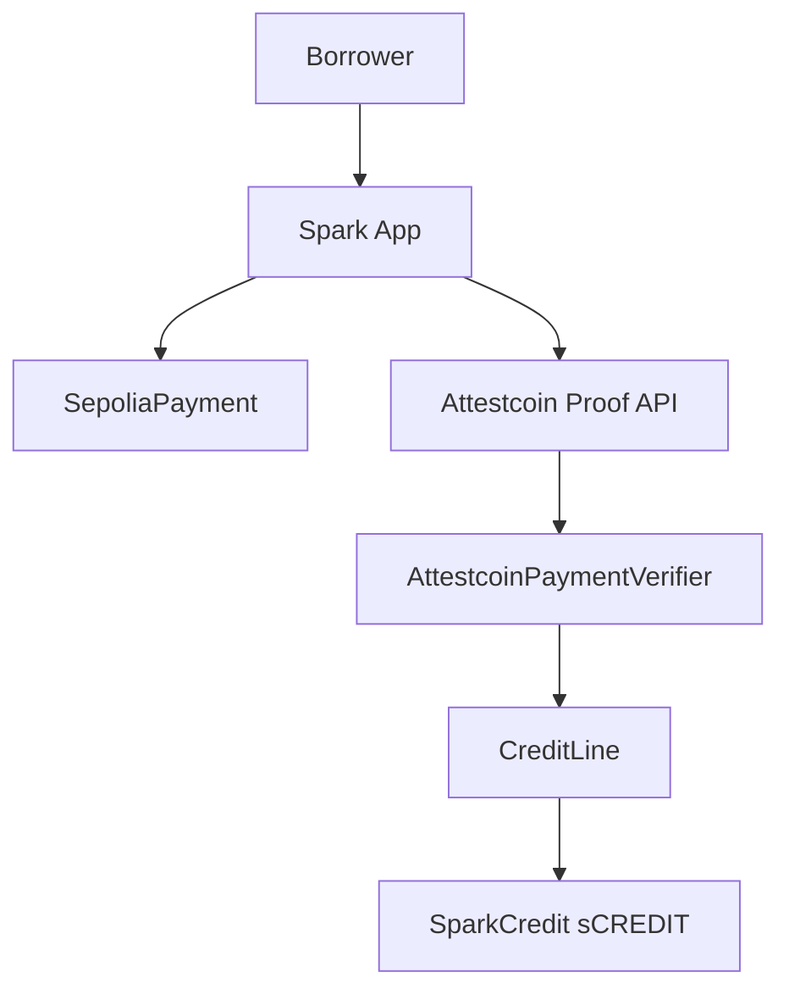

<p align="center">
  
</p>

<h1 align="center">Spark</h1>

<p align="center"><strong>Pay once. Unlock credit.</strong></p>

<p align="center">
  Verified Sepolia payment history is your credit score — no oracle.
</p>

<p align="center">
  
  
  
  
  
  
  
</p>

<p align="center">
  <a href="https://spark.sithunyein.com"><strong>spark.sithunyein.com</strong></a>
  ·
  <a href="https://spark.sithunyein.com/help">Help</a>
  ·
  <a href="https://github.com/thesithunyein/spark">GitHub</a>
  ·
  <a href="LICENSE">MIT License</a>
</p>

## What it is

**Spark** proves Sepolia payments with **Attestcoin** (USC / BlockProver), then opens or clears credit on **Creditcoin testnet**. No bank forms, no centralized price oracle.

- **Pay deposit** on Sepolia → dual Attestcoin proofs (deposit + ETH balance) → **open credit** on Creditcoin
- **Credit score** from on-chain attested payment history (650–850)
- **LTV bonus** from linked history (+2.5% at ≥1 payment, +5% at ≥3) plus balance-based LTV
- **Withdraw** sCREDIT, **redeem** against debt, **repay** on Sepolia to close

Live app: [https://spark.sithunyein.com](https://spark.sithunyein.com) · Deck: [deck.pdf](https://spark.sithunyein.com/deck.pdf)

## Demo flow (testnet)

```text
Pay deposit → Verify (Attestcoin ~8–20 min) → Withdraw → Redeem → Repay → Closed
```

Optional first: link past Sepolia payments on **Credit score** to raise score and LTV before opening a new line.

## Architecture



See [docs/architecture.md](docs/architecture.md) and [docs/attestcoin.md](docs/attestcoin.md).

## Project structure

Full repo layout (excluding `node_modules/`, `.next/`, `contracts/lib/` vendored deps):

```text
spark/
├── .env.example                      # Root env template (optional)
├── .gitignore
├── .gitmodules                       # forge-std submodule
├── package.json                      # Root scripts: dev, build, test:contracts
├── README.md
├── LICENSE
├── SECURITY.md
├── CONTRIBUTING.md
│
├── brand/                            # Logo source (copied into app/public/brand/)
│   ├── logo.png
│   ├── logo-mark.svg
│   ├── logo-on-orange.png
│   ├── logo-on-orange.svg
│   ├── logo-wordmark-dark.svg
│   └── logo-wordmark-light.svg
│
├── docs/
│   ├── addresses.md                  # Production + legacy contract addresses & Vercel env
│   ├── architecture.md               # System diagram, sequences
│   ├── attestcoin.md                 # USC / BlockProver integration
│   ├── deck.md                       # Pitch deck notes
│   └── deploy-vercel.md              # Vercel deploy (root dir = app)
│
├── app/                              # Next.js 15 — Vercel root directory
│   ├── .env.example                  # Local / production env template
│   ├── .gitignore
│   ├── package.json
│   ├── pnpm-lock.yaml
│   ├── next.config.ts
│   ├── next-env.d.ts
│   ├── tsconfig.json
│   ├── postcss.config.js
│   ├── tailwind.config.js
│   │
│   ├── public/
│   │   ├── favicon.svg
│   │   ├── favicon.png
│   │   ├── deck.pdf
│   │   ├── deck.html
│   │   └── brand/
│   │       ├── logo.png
│   │       ├── logo-mark.svg
│   │       ├── logo-on-orange.png
│   │       ├── logo-on-orange.svg
│   │       ├── logo-wordmark-dark.svg
│   │       ├── logo-wordmark-light.svg
│   │       └── metamask.png
│   │
│   └── src/
│       ├── styles/
│       │   └── globals.css
│       │
│       ├── app/                      # App Router
│       │   ├── layout.tsx            # Root layout, providers
│       │   ├── page.tsx              # / → redirect overview
│       │   ├── overview/page.tsx     # Dashboard, score, position, checklist
│       │   ├── pay/page.tsx          # Sepolia deposit + Attestcoin verify + openCredit
│       │   ├── score/page.tsx        # Link history → creditScore + LTV bonus
│       │   ├── withdraw/page.tsx     # Withdraw + redeem sCREDIT
│       │   ├── transfer/page.tsx     # Send & receive sCREDIT
│       │   ├── repay/page.tsx        # Sepolia repay + verify + close
│       │   ├── activity/page.tsx     # Payment journal (sidebar: Payments)
│       │   ├── help/page.tsx         # User guide
│       │   ├── settings/page.tsx     # Wallet, networks, security
│       │   └── advanced/page.tsx     # Developer / contract links
│       │
│       ├── components/
│       │   ├── AppShell.tsx          # Page shell + sidebar
│       │   ├── Sidebar.tsx           # Nav: overview, pay, score, withdraw, …
│       │   ├── Logo.tsx
│       │   ├── ConnectButton.tsx
│       │   ├── ConnectModal.tsx
│       │   ├── AccountMenu.tsx
│       │   ├── MetricCard.tsx
│       │   ├── PositionSnapshot.tsx
│       │   ├── ActivityTable.tsx
│       │   ├── OnboardingChecklist.tsx
│       │   ├── ConfirmingStages.tsx  # Pay/repay stepper
│       │   ├── AttestcoinProofPanel.tsx
│       │   ├── LinkHistoryPanel.tsx  # Credit score linking UI
│       │   ├── SuccessBanner.tsx
│       │   ├── PaymentHistoryStrip.tsx
│       │   └── SimpleChart.tsx
│       │
│       ├── hooks/
│       │   ├── usePaymentActivity.ts # Journal + Sepolia log scan
│       │   └── useChainTxConfirmation.ts
│       │
│       └── lib/
│           ├── config.ts             # NEXT_PUBLIC_* addresses & RPC
│           ├── abi.ts                # Contract ABIs
│           ├── wagmi.tsx             # MetaMask connector, Creditcoin chain
│           ├── sparkInjected.js      # Custom injected connector
│           ├── sparkInjected.d.ts
│           ├── usc.ts                # Attestcoin proof builder (parallel waits)
│           ├── chains.ts             # ensureCreditcoinChain / ensureSepoliaChain
│           ├── errors.ts             # friendlyError messages
│           ├── flowState.ts          # sessionStorage pay/repay resume
│           └── format.ts             # ETH formatting, proof encoding
│
└── contracts/                        # Foundry
    ├── foundry.toml
    ├── foundry.lock
    ├── remappings.txt
    ├── lib/
    │   └── forge-std/                # Git submodule
    │
    ├── src/
    │   ├── SepoliaPayment.sol        # payDeposit, payRepayment, attestBalance
    │   ├── CreditLine.sol            # openCredit, score, history bonus, redeem, repay
    │   ├── AttestcoinPaymentVerifier.sol
    │   ├── SparkCredit.sol           # sCREDIT ERC-20
    │   ├── MockPaymentVerifier.sol   # Unit tests only
    │   └── interfaces/
    │       └── IPaymentVerifier.sol
    │
    ├── test/
    │   └── Spark.t.sol               # Score, history, dual-proof open
    │
    ├── script/
    │   └── Deploy.s.sol
    │
    └── scripts/
        ├── deploy-all.sh
        ├── deploy-attestcoin.ps1
        ├── attestcoin-ctor-args.txt
        └── creditline-ctor-args.txt
```

## Deployed contracts

### Production (live site — credit-score stack)

| Contract | Network | Address | Verified |
|---|---|---|---|
| SepoliaPayment | Ethereum Sepolia | [`0x63F0c69cf9F8b53E8eDD141d07fF2eEd2237ccc4`](https://eth-sepolia.blockscout.com/address/0x63F0c69cf9F8b53E8eDD141d07fF2eEd2237ccc4) | Yes (Blockscout) |
| AttestcoinPaymentVerifier | Creditcoin testnet | [`0xF13205Bdf48A3159d4A46309C639930aE8faC130`](https://creditcoin-testnet.blockscout.com/address/0xF13205Bdf48A3159d4A46309C639930aE8faC130) | Yes |
| CreditLine (history + score + LTV bonus) | Creditcoin testnet | [`0x2C3585019B957b16459C409f34973b583267C742`](https://creditcoin-testnet.blockscout.com/address/0x2C3585019B957b16459C409f34973b583267C742) | Yes (Blockscout) |
| SparkCredit (sCREDIT) | Creditcoin testnet | [`0x1BaDE07F2F3295528a2F7316119813b6846dFfaD`](https://creditcoin-testnet.blockscout.com/address/0x1BaDE07F2F3295528a2F7316119813b6846dFfaD) | Yes |
| BlockProver (USC precompile) | Creditcoin | `0x0000000000000000000000000000000000000FD2` | n/a |

### Legacy (Aug 13 dual-proof — finish open repay via Repay page)

| Contract | Network | Address |
|---|---|---|
| SepoliaPayment | Ethereum Sepolia | [`0x4B137F56A0b5A8633D079d2d6b34d6aC5CdD22E9`](https://eth-sepolia.blockscout.com/address/0x4B137F56A0b5A8633D079d2d6b34d6aC5CdD22E9) |
| AttestcoinPaymentVerifier | Creditcoin testnet | [`0x372BF96DFfa019A03E861d57CfC8a129172C8A3C`](https://creditcoin-testnet.blockscout.com/address/0x372BF96DFfa019A03E861d57CfC8a129172C8A3C) |
| CreditLine (dual-proof + interest) | Creditcoin testnet | [`0x1Ba750b08dC4C06B993DfDedE45d22cbD540D319`](https://creditcoin-testnet.blockscout.com/address/0x1Ba750b08dC4C06B993DfDedE45d22cbD540D319) |
| SparkCredit (sCREDIT) | Creditcoin testnet | [`0xFa18A5458a973a4E8a3eF327A88262683B64b02b`](https://creditcoin-testnet.blockscout.com/address/0xFa18A5458a973a4E8a3eF327A88262683B64b02b) |

Retired stacks and Vercel env values: [docs/addresses.md](docs/addresses.md).

## Proof of record

On-chain demo wallet: [`0x7A35f63F81357DaDE2cff8f5699b935786Aa9Da2`](https://creditcoin-testnet.blockscout.com/address/0x7A35f63F81357DaDE2cff8f5699b935786Aa9Da2). All txs below are on the **production** CreditLine (`0x2C358501…`) with real Attestcoin USC proofs (BlockProver `TransactionVerified` in each tx).

### Aug 14 open — 95% LTV (history bonus at cap)

`CreditOpened`: deposit **0.01 ETH**, attested balance **~0.357 ETH**, credit **0.0095 ETH**, **`factorBps = 9500`** (95% LTV — base 90% + 500 bps history bonus at ≥3 linked payments).

- Creditcoin: [`0xbbec27e622b18d21bdedb24fabc072041aa0fe3ad7419b952a1e2b8754bba618`](https://creditcoin-testnet.blockscout.com/tx/0xbbec27e622b18d21bdedb24fabc072041aa0fe3ad7419b952a1e2b8754bba618)

### Attested payment history — score exercised

**5** `AttestedPaymentLinked` events on production CreditLine (kinds **1** = deposit, **2** = repayment). On-chain `creditScore()` = **850** (650 base + 5 × 40).

| # | Kind | Creditcoin tx |
|---|---|---|
| 1 | deposit | [`0xe5ec5506…da9c1`](https://creditcoin-testnet.blockscout.com/tx/0xe5ec5506ccdc54851e6c08674b2649d7efa1033220ef768dcc0583f1bf1da9c1) |
| 2 | repayment | [`0xe7313fef…9f15`](https://creditcoin-testnet.blockscout.com/tx/0xe7313fefc01b8e2c0d86fc789f5479c3c5c94cd29abc8fc5a53bcfc6fd669f15) |
| 3 | repayment | [`0x5092e516…18eb4`](https://creditcoin-testnet.blockscout.com/tx/0x5092e5165c0fedaf85b53a8c20b9710d4b60a97b3ccaa3e815ec5fda42c18eb4) |
| 4 | deposit | [`0xbbec27e6…a618`](https://creditcoin-testnet.blockscout.com/tx/0xbbec27e622b18d21bdedb24fabc072041aa0fe3ad7419b952a1e2b8754bba618) |
| 5 | repayment | [`0x5fc0b4fb…e122`](https://creditcoin-testnet.blockscout.com/tx/0x5fc0b4fb25496306c451ef46a1dfad0a2eab775f558b2b6820b3e1a2e723e122) |

Full log index: [CreditLine events](https://creditcoin-testnet.blockscout.com/address/0x2C3585019B957b16459C409f34973b583267C742?tab=logs).

### Two full closed loops (Open → Withdraw → Redeem → Repay → Close)

Both loops use real USC proofs end-to-end. Sepolia repay txs linked at close via `CreditClosed`.

**Loop 1 — Aug 13** (`factorBps = 9000`, credit 0.009 ETH)

| Step | Creditcoin tx |
|---|---|
| Open | [`0xe5ec5506…da9c1`](https://creditcoin-testnet.blockscout.com/tx/0xe5ec5506ccdc54851e6c08674b2649d7efa1033220ef768dcc0583f1bf1da9c1) |
| Withdraw | [`0xbf411c5a…1f3d`](https://creditcoin-testnet.blockscout.com/tx/0xbf411c5aeba0dc7b4105b4fdc992ca09b22bb289aa008ee58690d6c575601f3d) |
| Redeem | [`0x48980365…cfb01`](https://creditcoin-testnet.blockscout.com/tx/0x48980365b9366b32b608f5945f16744c69cb1d31b091c0f0bc94120d8d8cfb01) |
| Repay + close | [`0x5092e516…18eb4`](https://creditcoin-testnet.blockscout.com/tx/0x5092e5165c0fedaf85b53a8c20b9710d4b60a97b3ccaa3e815ec5fda42c18eb4) |

**Loop 2 — Aug 14** (`factorBps = 9500`, credit 0.0095 ETH)

| Step | Creditcoin tx |
|---|---|
| Open | [`0xbbec27e6…a618`](https://creditcoin-testnet.blockscout.com/tx/0xbbec27e622b18d21bdedb24fabc072041aa0fe3ad7419b952a1e2b8754bba618) |
| Withdraw | [`0x3bc160b1…2789`](https://creditcoin-testnet.blockscout.com/tx/0x3bc160b1a2a1e3c0b1e5065387f15c0383fcad9f2c0566b8653a41fddf232789) |
| Redeem | [`0x9177c410…d34d`](https://creditcoin-testnet.blockscout.com/tx/0x9177c4107aae3189926653fb7e9c8c2d24b9770c75b40cb56fb72574f081d34d) |
| Repay + close | [`0x5fc0b4fb…e122`](https://creditcoin-testnet.blockscout.com/tx/0x5fc0b4fb25496306c451ef46a1dfad0a2eab775f558b2b6820b3e1a2e723e122) |

**Sepolia repayments** (kind-2 USC proofs consumed at close):

- Loop 1: [`0x5fa5d7a2…9785`](https://sepolia.etherscan.io/tx/0x5fa5d7a22da9fbefd4cf0a6190f9ee342967637f470c53fd4adf3e2431229785)
- Loop 2: [`0xf3825f7f…ebe6`](https://sepolia.etherscan.io/tx/0xf3825f7f73461d9ca54ad6c3183521a85a7dcddee8b7a12dd9f820c40aa0ebe6)

## Quickstart

```bash
# Install (from repo root)
pnpm install --dir app

# Contracts
cd contracts && forge test

# App
cd ../app
cp .env.example .env.local   # fill RPC URLs if needed
pnpm dev
```

Open [http://localhost:3000](http://localhost:3000). User guide: in-app **Help** or [spark.sithunyein.com/help](https://spark.sithunyein.com/help).

## Deploy

| Target | How |
|---|---|
| App | Vercel, root directory `app` — [docs/deploy-vercel.md](docs/deploy-vercel.md) |
| Contracts | Foundry `contracts/script/Deploy.s.sol` → update [docs/addresses.md](docs/addresses.md) + Vercel env |

## Credit score (on-chain)

| Metric | Rule |
|---|---|
| Score | 650 base + 40 × attested payments (cap **850**) |
| LTV bonus | +250 bps (≥1 payment), +500 bps (≥3 payments) |
| Balance LTV | ≥2× deposit → 90%, ≥1× → 85%, else 80% base |
| Proof | `submitAttestedPayment` links past Sepolia txs; `openCredit` / `repayCredit` also count |

Formula lives in `contracts/src/CreditLine.sol` — readable via `creditScore()` and `getHistory()`.

## Roadmap

| Phase | Focus |
|---|---|
| **Now** | Live testnet: dual Attestcoin proofs, score, history LTV, full borrow/repay loop |
| **Next** | Faster verify UX, stricter log decoding in verifier |
| **Later** | Mainnet, audit, single-network UX |

## Security

Not audited. Testnet only. See [SECURITY.md](SECURITY.md). No private keys on Vercel.

**Verifier note:** BlockProver proves inclusion; the adapter checks contract, topic, and payer in tx bytes. Fine for demo; production would strict-decode receipts and bind amounts.

## License

MIT — [LICENSE](LICENSE).
