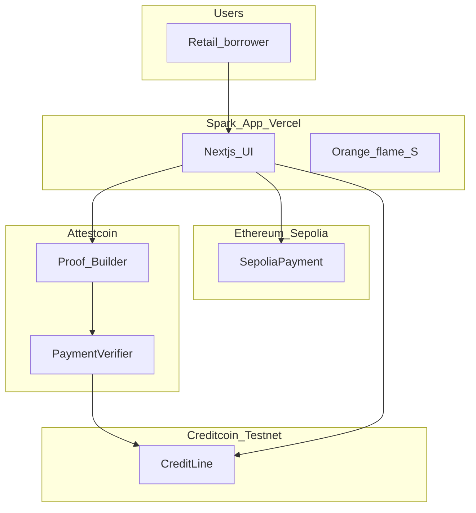
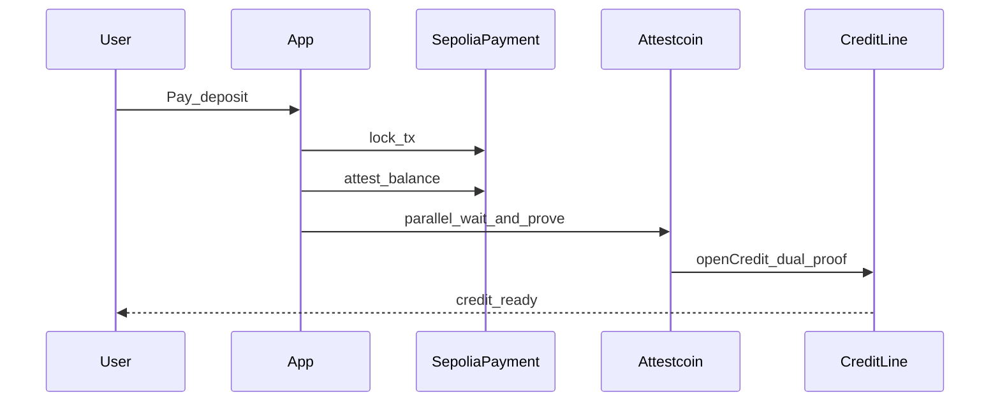

# Architecture

## System

## Security

1. Verify before state change
2. One-time `txHash`
3. Payer must be `msg.sender`
4. Amounts come from the verified claim, not free-form UI trust
5. No private keys on Vercel

## Sequence — open credit

## Sequence — credit score

Link past Sepolia payments via `submitAttestedPayment` (Attestcoin proof each). History raises `creditScore` and `historyBonusBps` before the next `openCredit`.
